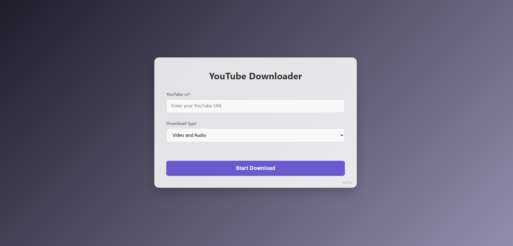
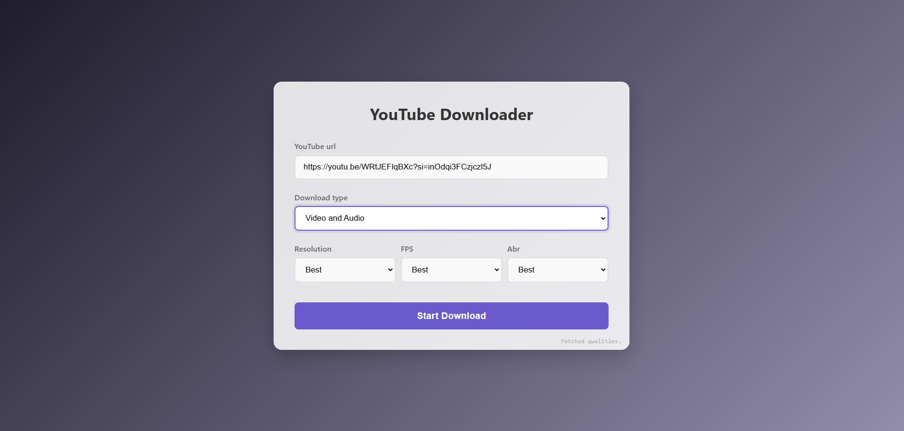
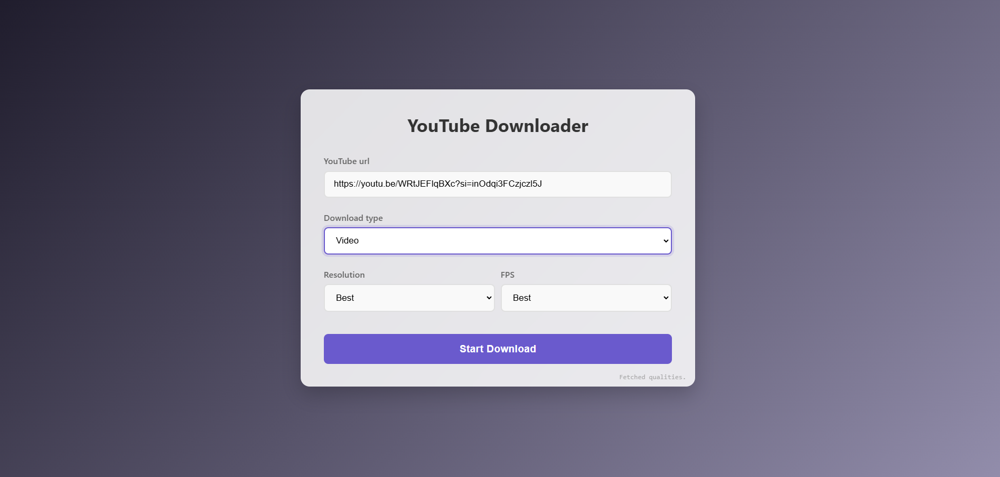
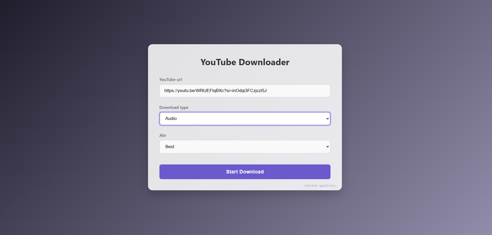

# 一個基於 FastAPI + Pytubefix 的 YouTube Downloader WebUI

## ✨ 特點
- 下載後的檔案會儲存在 `data/outputs`，如果下次使用相同 解析度/fps/abr 時，可以直接快取

## 🚀 Quick start
執行主程式後，會**自動從瀏覽器開啟網頁**。  
- 安裝 python >= 3.9 ~~(受限於 uvicorn 的版本限制)~~

- 使用 [uv](https://github.com/astral-sh/uv) (推薦):
    - `uv sync` (同步虛擬環境)
    - `uv run main.py` (執行主程式)
- 使用 pip:
    - `pip install -r requirements.txt`
    - `python main.py`
- 其他任何可執行 python 的方法

## 🔗 Demo
### 初始介面

  

### 選擇了 Video and Audio

  

### 選擇了 Video

  

### 選擇了 Audio

  

